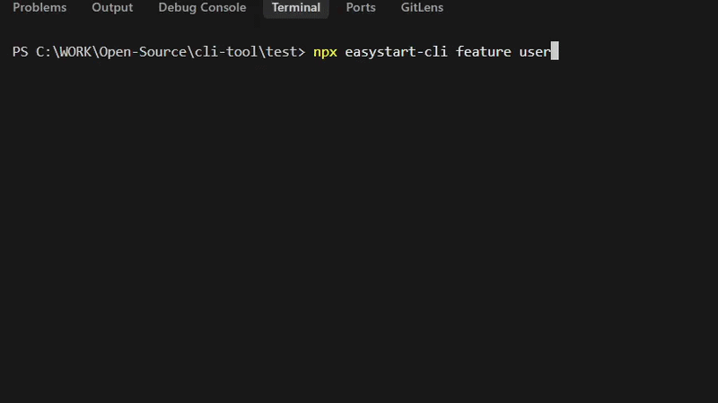

# EasyStart CLI

A minimal, configuration-driven command line tool to generate feature-based file structures for Express applications.

---

## Overview

EasyStart CLI helps developers scaffold consistent project structures using a simple configuration file. It focuses on flexibility, clarity, and speed without enforcing any specific architecture.

---

## Demo



---

## Features

* Simple command-based feature generation
* Config-driven architecture (no hardcoded structure)
* Supports multiple layers (controller, service, routes, etc.)
* Template-based file generation using placeholders
* Dry-run mode for previewing output
* Force mode to overwrite existing files
* Clean and predictable file structure output

---

## Installation

### Using npx

```bash
npx @fayaz/easystart-cli feature user
```

### Global installation

```bash
npm install -g @fayaz/easystart-cli
```

---

## Initialize Project

Run the init command inside your project root:

```bash
easystart-cli init
```

This creates:

```bash
cli.config.json
_templates/
```

Example structure:

```bash
project/
  cli.config.json
  _templates/
```

## Usage

```bash
easystart-cli feature <name>
```

### Example

```bash
easystart-cli feature user
```

---

## Options

| Flag      | Description                   |
| --------- | ----------------------------- |
| --dry-run | Preview files without writing |
| --force   | Overwrite existing files      |

### Examples

```bash
easystart-cli feature user --dry-run
easystart-cli feature user --force
```

---

## Configuration

Create a file named `cli.config.json` in the root of your project.

```json
{
  "layers": {
    "controller": {
      "path": "src/controllers",
      "template": "templates/controller.hbs",
      "filename": "{{name}}.controller.js"
    },
    "service": {
      "path": "src/services",
      "template": "templates/service.hbs",
      "filename": "{{name}}.service.js"
    },
    "routes": {
      "path": "src/routes",
      "template": "templates/routes.hbs",
      "filename": "{{name}}.routes.js"
    }
  }
}
```

---

## Template Example

```js
class {{Name}}Controller {
  constructor({{name}}Service) {
    this.service = {{name}}Service;
  }
}

module.exports = {{Name}}Controller;
```

---

## Supported Variables

| Variable | Example Output |
| -------- | -------------- |
| {{name}} | user           |
| {{Name}} | User           |

---

## Example Output Structure

```bash
src/
  controllers/
    user.controller.js
  services/
    user.service.js
  routes/
    user.routes.js
```

---

## Development

```bash
npm install
npm run dev -- feature user
npm run build
```

---

## Roadmap

* Preset-based generation (MVC, Clean Architecture)
* Plugin system support
* Interactive CLI mode
* Advanced templating support

---

## Contributing

Contributions are welcome. Please open an issue to discuss changes or improvements before submitting a pull request.

---

## License

MIT

---

## Author

Fayaz
